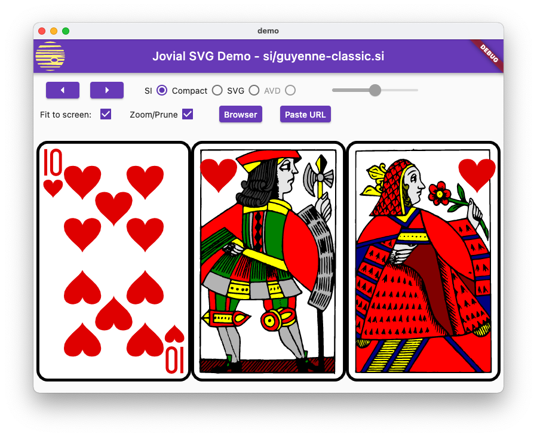

# jovial_svg 

Robust, efficient rendering of SVG static images, supporting a well-defined 
profile of SVG and an efficient binary storage format.  Very fast load times 
result from using this binary format - loading a pre-compiled binary file 
is usually 5x to 10x faster than parsing an XML SVG file.  

The supported SVG profile
includes the parts of 
[SVG Tiny 1.2](https://www.w3.org/TR/2008/REC-SVGTiny12-20081222/)
that are applicable to static images, plus commonly-used elements from
[SVG 1.1](https://www.w3.org/TR/2011/REC-SVG11-20110816/).  In addition,
[Android Vector Drawable](https://developer.android.com/guide/topics/graphics/vector-drawable-resources) files
are supported.  A widget for displaying scalable images is provided.

To try out the library, see the demo program at
[github](https://github.com/zathras/jovial_svg/tree/main/demo).  It's mostly
intended to be run on the desktop.  It lets you cycle through a series of test
images, including several taken from an open-source card game
([Aisleriot](https://wiki.gnome.org/Apps/Aisleriot)).

SVG profile notes:

  *  SVG paths and transforms are of course supported.
  *  The `use` element is supported (including forward references).
  *  Stroke modifiers like stroke-linecap, stroke-linejoin and
     stroke-miterlimit are supported.
  *  The `stroke-dasharray` and `stroke-dashoffset` attributes are
     supported (cf. Tiny s. 11.4).
  *  Gradients are supported, and additionally support xlink:href attributes 
     to other gradients, and gradientTransform attributes from SVG 1.1.
  *  Text elements are supported.
  *  Embedded images are supported.
  *  As per the Tiny spec s. 6.2, full CSS is not supported.  However, the
     `style=` attribute is supported as a way of specifying presentation
     attributes.
  *  Non-scaling stroke is not supported (not in SVG 1.1; cf. Tiny 11.5)
  *  Constrained transformations are not supported (not in SVG 1.1;
     cf. Tiny 7.7)
  *  A DOM and features related to animation are not supported.
  *  Conditional processing (Tiny s. 5.8) is not supported
  *  Text restrictions:
      * Embedded fonts are not supported.  However, the font-family attribute
        is used when selecting a font, and fonts can be included in an 
        application that uses this library.
      * `textArea` is not supported (not in SVG 1.1).
      * `font-variant` (`small-caps`) is not supported.
      * `rotate` is not supported (but normal transformations, including 
         rotation, apply to text elements).
      * Bi-directional text is not supported

This library was originally written because existing alternatives didn't
correctly handle many aspects of SVG.  This made it impossible to re-purpose
existing SVG graphics assets, e.g. from other open-source programs.

It must be said that the SVG specifications are rather large.  SVG 2 notably
added a rich set of features that aren't needed for a graphics interchange
format.  SVG in browsers also supports scripting and animation.  Finally, this
family of specifications has always been somewhat squishy about conformance
and profiling -- there's a whole set of resources devoted to tracking which
browsers support which features, and that's with fairly large teams developing
browsers over decades.

However, there are a large set of (quite beautiful!) SVG assets for static
images that generally stay within the bounds of SVG 1.1.  SVG Tiny 1.2 is a
reasonable collection of the most important parts of SVG 1.1.  One of the 
challenges in developing this kind of library is deciding which features are 
essential, and which are gold-plating that are not in wide use.  For this 
library informed guesses were necessary at some points.  

If you come across an SVG
asset that falls within the scope of this library, but which doesn't render,
please try to narrow down what support would be needed in the library, and 
submit an image that correctly uses that feature in any bug report.

